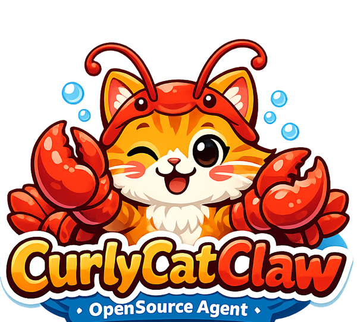

<p align="center">
  
</p>

<h1 align="center">🐈CurlyCatClaw🦞</h1>

<p align="center">
  A personal AI assistant that lives in your Telegram. Built in Go.
</p>

<p align="center">
  <a href="https://github.com/jialuohu/curlycatclaw/actions"></a>
  <a href="https://github.com/jialuohu/curlycatclaw/releases"></a>
  <a href="LICENSE"></a>
</p>

---

CurlyCatClaw is a long-running daemon that connects Claude to Telegram. You message your bot, it thinks with Claude, calls tools via MCP, and replies. SQLite keeps your conversation history. That's it.

## Features

### Core

- **Telegram-native** — message your bot like you'd message a friend
- **Claude-powered** — streaming responses with tool use, direct API or CLI subprocess mode (Claude Max subscription)
- **Real-time streaming** — text deltas streamed via message edits (500ms debounce), new messages per tool-use round
- **Image understanding** — send photos, Claude sees them via vision

### Memory & Context

- **Conversation memory** — SQLite (WAL mode), sliding window context (25 turns, ~150K tokens)
- **Hierarchical memory** — three tiers: user facts in system prompt, conversation summaries via Qdrant relevance search, current sliding window
- **Smart context** — Haiku-powered prompt budget manager classifies turn relevance
- **Vector search** — semantic retrieval via Qdrant with pluggable embeddings (FNV offline, Ollama local, Voyage AI)

### Extensibility

- **MCP tool integration** — connect any MCP server (search, filesystem, APIs) via stdio
- **Built-in skills** — web search, notes (size-limited), reminders (cron-validated), semantic search (result-capped), persistent user facts
- **Wasm plugins** — extend with custom skills via WebAssembly, capability-based security, 10 MiB query result cap, quote-aware SQL parameter binding, atomic hot-reload

### Operations

- **Health endpoint** — `GET /health` on localhost for Docker/monitoring liveness checks
- **Supervision** — automatic restart with exponential backoff, graceful 30s drain on shutdown
- **Configurable logging** — level, format (text/json), file output with lumberjack rotation
- **Docker ready** — Dockerfile + docker-compose with Qdrant, one command to run
- **Goreleaser** — automated multi-platform releases with checksums and Docker images

### Security

- **Landlock sandbox** — Linux filesystem restriction (opt-in)
- **Encrypted credentials** — AES-256-GCM for MCP server secrets
- **Secure defaults** — empty allowlist = no access, MCP env filtering, Wasm SSRF/DNS-rebinding protection, enforced `:user_id` scoping on user tables (UNION/INTERSECT/EXCEPT blocked), 50 MiB module cap, config fail-fast validation with embedder type checking
- **Tool transparency** — see what tools Claude calls; confirmation prompts for sensitive operations

## Quick Start

**Prerequisites:** Go 1.25+, a [Telegram bot token](https://t.me/BotFather), and either a [Claude API key](https://console.anthropic.com/) or the [Claude CLI](https://claude.ai/code) (for Max subscription mode).

```bash
# Clone and build
git clone https://github.com/jialuohu/curlycatclaw.git
cd curlycatclaw
go build -o curlycatclaw ./cmd/curlycatclaw

# Configure
mkdir -p ~/.curlycatclaw
cp config.toml.example ~/.curlycatclaw/config.toml
# Edit ~/.curlycatclaw/config.toml with your API keys

# Run
./curlycatclaw
```

Then message your Telegram bot. Done.

## Configuration

All config lives in `~/.curlycatclaw/config.toml`. Copy from the example:

```toml
timezone = "America/Los_Angeles"

[claude]
# Choose ONE auth method:
cli_path    = "/home/you/.local/bin/claude"  # Claude Max subscription (via CLI subprocess)
oauth_token = "sk-ant-oat01-..."             # long-lived token from `claude setup-token`
# api_key  = "sk-ant-..."                    # API key (direct API, separate billing)
model       = "claude-sonnet-4-6-20250514"

[telegram]
token = "123456:ABC-DEF..."
allowed_user_ids = [123456789]  # your Telegram user ID

[storage]
db_path = "/home/you/.curlycatclaw/curlycatclaw.db"

# Optional: MCP servers for extra tools
[[mcp.servers]]
name    = "search"
command = "npx"
args    = ["-y", "@anthropic/mcp-server-brave-search"]
[mcp.servers.env]
BRAVE_API_KEY = "encrypted:ref:brave_api_key"

# Health check (enabled by default)
[health]
enabled = true
port    = 8080
```

For encrypted MCP credentials, set `CURLYCATCLAW_MASTER_KEY` env var (64 hex chars = 32 bytes).

## Architecture

### System Overview

```
┌───────────────────────────────────────────────────────┐
│                     Supervisor                        │
│          (panic/recover, backoff, 30s drain)          │
│                                                       │
│  ┌──────────┐   ┌───────────┐   ┌───────────┐         │
│  │ Channel  │◄─►│  Session  │   │ Reminder  │         │
│  │  Actor   │   │   Actor   │   │   Actor   │         │
│  └────┬─────┘   └─────┬─────┘   └─────┬─────┘         │
│       │               │               │               │
│       │               ├──► Claude     │               │
│       │               │    Direct API (stream+tools)  │
│       │               │    OR CLI subprocess (Max)    │
│       │               │               │               │
│       │               ├──► Tools      │               │
│       │               │    Skills / MCP / Wasm        │
│       │               │               │               │
│       │               └──► Memory ◄───┘               │
│       │                    SQLite / Budget / Vector   │
│       │                                               │
│       │◄── [tool] lines + [confirm?] previews         │
│       │                                               │
└───────┼───────────────────────────────────────────────┘
        │                  │
   Telegram            Landlock
   Bot API          (Linux sandbox)
```

Everything runs as goroutine-based actors under supervision. If an actor panics, it restarts with exponential backoff (1s → 30s), resetting after 60s healthy. On shutdown, actors get 30 seconds to drain before forced exit.

### Streaming Pipeline

```
Telegram ──► Channel Actor ──► Session Actor ──► Claude API (streaming)
               (long-poll,       (context,           │
                photos)           tools)             │ content deltas
                                                     ▼
                                              onDelta() ── 500ms debounce
                                                     │
                                              flush() ── releases mutex during
                                                     │   Telegram I/O (flushing flag)
                                                     │
              Telegram ◄── send/edit ◄───────────────┘
                                                     │
                                              Tool calls? ─── No ──► done
                                                     │
                                                    Yes
                                                     │
                                              Execute tools, reset stream
                                              state, loop (max 10 rounds)
```

Each tool round produces a distinct Telegram message. Text edits respect Telegram's 4096-char limit -- long responses split automatically. The `flushing` state flag prevents lock contention during Telegram I/O.

### Memory System

Three-tier hierarchical memory with smart context building:

```
Context Assembly (per request)
┌──────────────────────────────────────────────────────────┐
│  Tier 1 (always)    │ User Facts (SQLite)                │  system prompt
│  Tier 2 (semantic)  │ Relevant Summaries (Qdrant)        │  cosine similarity
│  Tier 3 (window)    │ Recent Messages (SQLite)           │  25 turns, ~150K tokens
└──────────────────────────────────────────────────────────┘

Budget Classification (per turn in Tier 3):
  Keyword match ──hit──► "full" (include verbatim)
       │ miss
  SHA256 cache (7d TTL) ──hit──► cached result
       │ miss
  Haiku LLM (batch) ──► "full" | "summary" (1-line) | "none" (drop)

Conversation Archival (>4h idle):
  Expired conv ──► Load messages ──► Format (4K) ──► Claude summarize
                                                           │
                                          SQLite (text) ◄──┤
                                          Qdrant (embed) ◄─┘
```

### Tool Execution

Three tool sources unified under one routing layer:

```
Claude tool_use ──► skills.Registry.Get(name)
                     ├─ Found ──► Built-in Skill (with UserInfo ctx)
                     └─ Not found ──► MCP Manager (server__tool namespace)

┌──────────────────┬───────────────────┬──────────────────────┐
│  Built-in Skills │  MCP Servers      │  Wasm Plugins        │
├──────────────────┼───────────────────┼──────────────────────┤
│  web_search      │  Namespaced:      │  Capability-gated:   │
│  save_note       │  server__tool     │  ├ http (SSRF block) │
│  set_reminder    │                   │  ├ db_read (enforced │
│  remember_fact   │  Env filtered     │  │  :user_id scoping,│
│  semantic_search │  via allowlist    │  │  UNION blocked)   │
│                  │                   │  └ send_message      │
│  Deps: FactStore │  _user_context    │                      │
│  DB, VectorStore │  injected per call│ Hot-reload (fsnotify)│
└──────────────────┴───────────────────┴──────────────────────┘
                        │
                        ▼
               Tool result → Claude (next loop round)
```

### Vector Search

Pluggable embeddings with three Qdrant collections:

```
Embedder Interface: Embed(text) → vector
  ├─ FNV (384d, offline, no deps)
  ├─ Ollama (768d, local, nomic-embed-text)
  └─ Voyage AI (512d, API, voyage-3-lite)

Qdrant (gRPC, cosine similarity, user_id tenant isolation):
  ├─ curlycatclaw_messages   ◄── user messages
  ├─ curlycatclaw_notes      ◄── saved notes
  └─ curlycatclaw_summaries  ◄── archived conversations

query → Embed(query) → Qdrant.Search(vector, user_id filter) → ranked results
```

## Built-in Skills

| Skill | Description |
|-------|-------------|
| `web_search` | Search the web via DuckDuckGo |
| `save_note` | Save a note (user-scoped, persisted to SQLite) |
| `search_notes` | Search saved notes by keyword |
| `set_reminder` | Set a reminder with time and optional recurrence |
| `list_reminders` | List pending/fired reminders |
| `cancel_reminder` | Cancel a scheduled reminder |
| `semantic_search` | Search conversation history and notes by meaning (requires Qdrant) |
| `remember_fact` | Save a persistent fact about you across all conversations |
| `forget_fact` | Remove a saved fact by ID |
| `list_facts` | List all persistent facts Claude remembers about you |

Skills are registered alongside MCP tools — Claude sees them all and picks the right one. Wasm plugins load from `~/.curlycatclaw/skills/*.wasm` when enabled.

## Deployment

### Docker (recommended)

```bash
# Your ~/.curlycatclaw/config.toml is used directly.
# Docker overrides paths via environment variables automatically.
docker compose up -d
```

See [deploy/docker.md](deploy/docker.md) for details and MCP limitations.

## Testing

```bash
go test ./... -count=1 -race
```

## License

[MIT](LICENSE)
